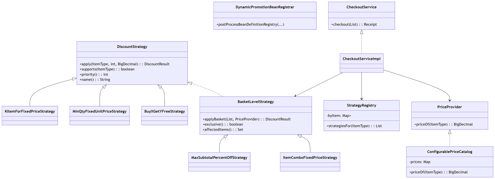
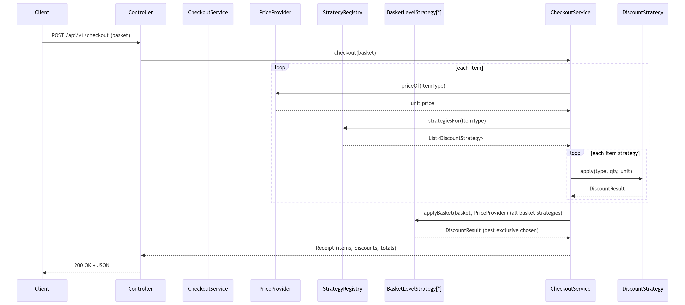
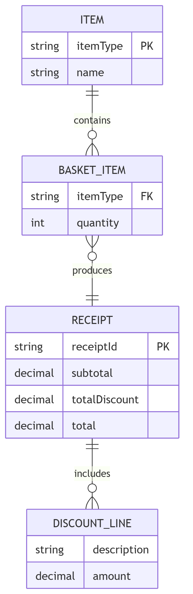

# Grocery Store Checkout

## Overview
Production-ready Spring Boot based Grocery Checkout application designed with **SOLID** design Principle, **Strategy pattern** for promotions, **Actuator**. Built to compile cleanly with Lombok.

## Run
```bash
mvn clean package
mvn spring-boot:run
```

## Architecture
- Controller (HTTP): DTOs, validation, request → service calls.
- Service layer: Pricing, Promotions, Checkout aggregation.
- Domain: Enum/types (ItemType), Receipt, BasketItem.

Infrastructure: Price provider (JSON), dynamic promotions registrar.
Business logic is isolated from framework—easier to test and swap implementations

## Endpoints
- Swagger UI: `http://localhost:8080/swagger-ui/index.html`
- Actuator: `http://localhost:8080/actuator` (health, info, metrics, prometheus, etc.)
- API: `GET /api/v1/items`, `POST /api/v1/checkout`

## Assumptions
### Core behavior
- Basket Input: The API accepts a list of items {name|type, quantity}. Quantity is a positive integer (>= 1). Non‑positive or non‑integer quantities are rejected with 400 Bad Request.
- Item Identity: Items are mapped via a canonical ItemType enum (e.g., BANANAS, ORANGES, APPLES, LEMONS, PEACHES). Any unknown item name/type returns 400 Bad Request, with an actionable message.
- Receipt Output: The system returns an itemized receipt:
- items[]: {itemName, quantity, amount} where amount is line total before discounts.
- discounts[]: {description, amount}, where amount is negative (display) to represent subtraction from the subtotal. If no discounts apply, we include a single line: "No discount applicable" with 0.00.
- subtotal (sum of items before discounts), totalDiscount (sum of discount amounts; negative for user readability), and total (subtotal + totalDiscount).
  - Currency & Rounding: All amounts use GBP (£) and two‑decimal, HALF_UP rounding at presentation. Internally, monetary operations use BigDecimal with scale 2 unless explicitly noted.
  - Idempotency: A given basket should yield the same receipt every time for the same active pricing version and promotion set. If an idempotency key is provided, duplicate requests within a window (e.g., 5 minutes) return the same receipt.

### Dynamic Pricing (Price Provider)
- ConfigurablePriceCatalog implements PriceProvider and loads prices exclusively from prices.json. 

### Discount Assumptions (Promotions)
* Strategy model 
- Open/Closed Principle: Promotions are implemented via strategy classes. Adding a new promotion means adding a new strategy and registering it—no changes to core checkout logic.
- Per‑item strategies: Each strategy declares supports(ItemType) and a priority() (lower runs first). The registry returns strategies filtered by item and sorted by priority.
- Interfaces: Services (e.g., CheckoutService, ItemCatalogService) are interfaces with clean implementation classes for testability and substitution.

### Basket vs Item Strategies
- Item-level: supports(ItemType) returns true only for the configured item; priority() controls ordering.
- Basket-level: Implement BasketLevelStrategy, provide applyBasket(...), exclusive(), and affectedItems(). Checkout applies one best exclusive basket promo (e.g., combo) and suppresses per-item strategies for its affected items to avoid double-stacking

### Out of Scope
Payments
Authentication
Taxes
Distributed inventory

## API 
### GET /api/v1/items 
Returns a snapshot of items and current prices.
- Example Request
```bash
curl --location --request GET 'http://localhost:8080/api/v1/items'
```

### POST /api/v1/checkout 
Accepts basket and returns an itemized receipt with discounts.
- Example Request:
```bash
curl --location --request POST 'http://localhost:8080/api/v1/checkout' \
--header 'Content-Type: application/json' \
--data-raw '{
  "items": [
    { "item": "Bananas", "quantity": 7 },
    { "item": "Oranges", "quantity": 10 },
    { "item": "Apples",  "quantity": 1 }
  ]
}'
```
- Example Output: 
```
{"items": [
    {"itemName":"Banana","quantity":7,"amount":3.50},
    {"itemName":"Orange","quantity":10,"amount":3.00},
    {"itemName":"Apple","quantity":1,"amount":0.60}
    ],
"discounts":[
    {"description":"Buy 2 Get 1 Free (Bananas)","amount":-1.00},
    {"description":"3 Oranges for £0.75","amount":-0.45}
    ],
"subtotal":7.10,
"totalDiscount":-1.45,
"total":5.65
}
```

## Promotions
- Bananas: **Buy 2, get 1 free**.
- Oranges: **3 for £0.75**.
- Combo: **Combo APPLES:1,BANANAS:2 for 1.25 (x3)**.

## Architecture & Modularity
### Clean Architecture:
domain (models, strategies, services) has no framework dependencies.
web (controllers/DTOs) is a thin adapter.
infrastructure (pricing providers, DB) is behind interfaces, so the DB layer can be swapped without changing business code.

### SOLID Principles:
- **SRP**: pricing, promos, checkout aggregation, API layers.
- **OCP**: add new promos via `DiscountStrategy`, no service changes.
- **LSP**: strategies honor a single contract.
- **ISP**: DTOs isolated from domain.
- **DIP**: `CheckoutService` depends on `PriceProvider` & `StrategyRegistry`.

## Observability & Health
- **Actuator** exposes health, info, metrics, and Prometheus endpoint.

## Error Handling
- Global `@RestControllerAdvice` returns RFC-7807 `ProblemDetail` responses for validation and domain errors.

## Diagrams
### Class Diagram (core)


### Sequence Diagram (checkout runtime)


### ER Diagram (domain snapshot)
